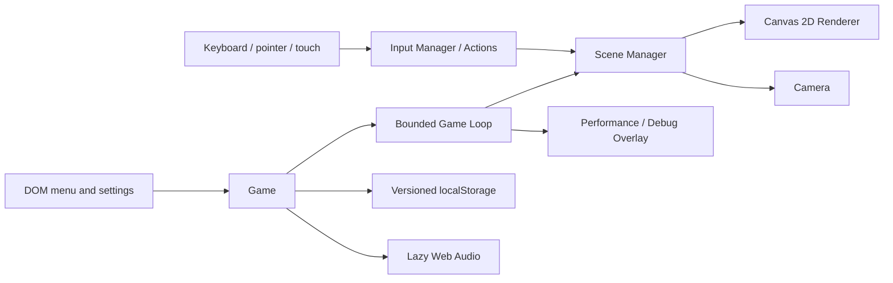

# Sprint 1 Engine Architecture

Sprint 1 deliberately uses browser primitives rather than an engine framework. State/lifecycle code does not depend on Canvas, the renderer owns drawing only, and the DOM owns text-heavy or accessibility-sensitive controls.

`Game` is the composition root. `GameLoop` owns animation scheduling and bounded time. `SceneManager` serializes transitions and lifecycle calls. Scenes update state and request rendering without becoming global state containers. `InputManager` converts browser events into actions and frame-local pointer deltas. `Camera` is pure math and independent of the renderer.

All long-lived platform listeners have explicit disposal. Hidden tabs pause updates and reset the delta baseline. Rendering scales the backing buffer up to a safe DPR cap while retaining CSS-pixel coordinates for input and camera math.
