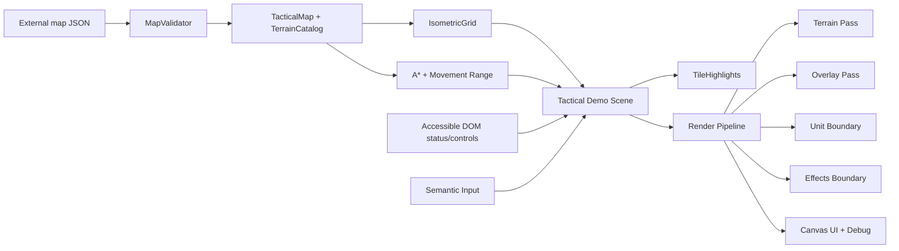

# Sprint 2 Tactical Architecture

## Dependency graph

Dependencies point from composition toward stable, lower-level data and math. Navigation never imports rendering; rendering reads resolved state but cannot mutate map truth.

## Public systems

| System | Responsibility | Explicit non-responsibility |
|---|---|---|
| `MapValidator` / `MapLoader` | Version, structure, safe defaults, transport failure | Gameplay decisions |
| `TerrainCatalog` / `TacticalMap` | Resolve terrain and per-tile overrides | Rendering and unit occupancy |
| `IsometricGrid` | Grid/world/screen transforms, origins, polygons, picking | Camera ownership |
| `Camera` | Smooth view transform, follow, fit, edge/inertial pan | Tactical selection |
| `Pathfinder` | Least-cost route with occupancy/elevation constraints and bounded cache | Turn legality |
| `movementRange` | Cheapest reachable tiles and remaining budget | Unit movement execution |
| `TileHighlights` | Deterministic semantic overlay layering | Range calculation |
| `TacticalRenderPipeline` | Ordered Canvas passes and draw-call accounting | Authoritative state |

## Performance boundaries

Map resolution happens once per load. Path queries use a bounded 64-entry cache. Navigation uses a binary heap rather than repeatedly sorting an open list. Render passes reuse the existing Canvas/context and camera. The demo map is compact; dirty rectangles are not enabled because a moving/zooming isometric camera invalidates most of the viewport, making full redraw cheaper and simpler at this scale. Object pooling should be introduced for transient unit/effect entities when those systems exist rather than speculatively pooling immutable grid points.
